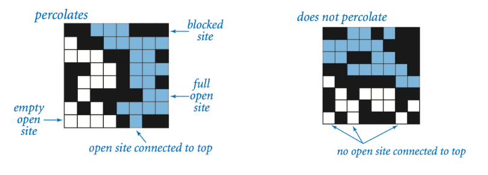
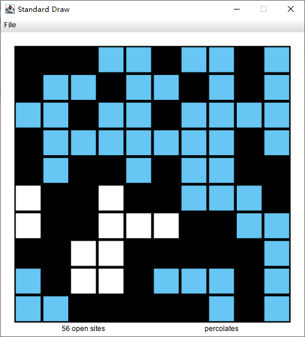

# Princeton Coursera 算法课程作业总结

**表达欲过剩产生的闲扯**

研究生快毕业了，摸鱼之余对自己的能耐也很没信心，于是捡起之前看一半丢掉的《算法（第四版）》来。这书原版在2012年以后更新飞快，现在不知道到了第几个版本了，但可能是主体内容变化不大加引进方信心不足的缘故，没听说后续的翻译计划。教材官网有一整套非常棒的学习资源，可以说你甚至不需要这本教材，单用在线内容就能学到教材涵盖的大多数话题。

言归正传。对我这种懒癌晚期的家伙来说，学东西是需要督促加引导的。刚好 Coursera 上有几乎与教材配套的在线课程，内容虽然比较早（也是2012年版）但刚好与书无缝衔接。当年我曾过了一遍，但实际只是蜻蜓点水，根本没学进去。

在线课程内容里最棒的其实是编程作业，不仅有题目，有绝佳的可视化，而且有一组完备的在线代码检测程序。检查内容除了基本的代码是否能正确编译、答案是否正确，还有代码风格检查、运行时间和占用内存检查，以及达到100分后，还有在资源限制下巧妙解决问题的 bonus 分数。

按理（Code Honour）说，作业必须独立完成；网上坚持做完 Part1、Part2 的人也并不多，能拿到 bonus 更是少之又少。所以这份代码其实挺“值钱”的括弧笑，而且确实不应该这么大大咧咧分享出来。但从第一周的 Percolation 开始，我经过了很艰难的过程才最终拿到 101.25% 这个分数。要是没有参考网上公开的一些代码、博客和课程讨论区，是不可能做到这一点的。

所以我依然觉得把思路分享出来不是件坏事。

至于抄不抄这些代码就尽随读者。我想起上中学时的一些事情，同学里抄别人的答案、抄练习题答案的数不胜数。但到了现在的阶段都不是小孩子了，靠抄答案过关有用吗……

总之，不管用什么方法，自己埋头尝试也罢，参考别人的思路和代码也罢，只要深入思考并付出努力，最后拿到这个分数的时候，你会感受到它的价值所在。

****

**作业情况简介**

Coursera 大幅更新过后一些热门课程的内容也有所更新，这门课的管理者就更新了作业附件以及 IDE。IDE 采用了定制的 Community 版 IntelliJ，内嵌了 CheckStyle 等插件。与官网的 IntelliJ 有一些区别，我暂时还没摸清整个环境，不过用起来还是比较方便的。

注意所有的作业都不会让你去重新实现一遍正在讲授数据结构，而是通过设计与之相关的题目增进你对它的了解。所以需要的时候请直接调用 `edu.princeton.cs.algs4` 里的 API。

## 第一周：Percolation

视频中提前介绍了这部分作业，给出了一个使用双节点`virtualTop`、`virtualBottom`的方法。但接着提到了“倒灌”问题（如下）：

原因很简单。按照这种方法，判断是否渗透（percolate）直接通过判断 `virtualTop`、`virtualBottom` 是否 `connected()`。所以一旦渗透，所有与 `virtualBottom` 节点相连的节点也就都与 `virtualTop ` 相连了——`isFull()` 就是这么实现的。仅通过改变这几个方法是不能实现正确结果的。对了，提交之前一定要本地看一下，别闷着头就交上去了，浪费时间：

得到100/100的最简单方案，也是目前网上绝大多数代码都是采用了双`union-find`，一个用来判断是否渗透，一个用来避免倒灌。本题的 bonus 则是限制只能用一个 `union-find` （通过检查变量占用的内存空间）。说实话这条要求其实挺难的，看网上代码就知道很多人压根儿没做出来。

我也翻了不少博客、源码和讨论区，最后在一篇中文博客的帮助下解决了问题：

https://segmentfault.com/a/1190000005345079#articleHeader1

代码按照它的思路来写，注意细节就能拿到分数了。写完回头看，其实要写的代码行数并不多，关键就在细节上。

文中提到的嘲讽脸我没找到，不知是不是新版作业里没了那张图……

****

**剧透警告： 请仔细考虑是否阅读以下文字**

> 1. 使用一个 `byte` 型`state`数组存储所有元素的“状态”：0 代表堵塞（blocked），1 代表打开（open），2 代表与底部连接；
> 2. 打开一个节点（site）时，如果这个节点在第一行，将其与"虚拟顶"相连，在第 n 行（最后一行）就令对应的 `state` 为2，否则置1；
> 3. 检查四邻，如果邻节点已经打开，那么将其与当前节点连通，并检查当前节点、邻节点的根（root site）状态值是否等于2，二者之一等于2，则将二者都置为2，根用`uf.find()` 获得。
>
> 2、3 不能交换顺序，必须先打开节点、后检查邻域（我就犯了这么个愚蠢的错误）。
>
> 3 中使用根而非节点的状态值极大减少了后续操作的运算量，请相信对数时间的效率。
>
> 这样一来，`isOpen()` 返回的是判断语句 `state[p] > 0` ，`isFull()` 依然依赖 `uf.connected(p, virtualTop)` 。`percolate()` 最好使用一个 `private boolean`  单独保存，在每一次 `open()` 的最后检查 `uf.find(virtualTop)` 位置上的 `[] state` 是否是2，是则表明“顶”已经与“底”相连接了。
>
> 也有代码使用了两个 `boolean` 数组来代替两个 `union-find` 的作用，不过我觉得一个 `uf`加一个状态记录`state` 就够了，多写易错。
>
> 再反思一下。为什么作业会提“只用一个`uf` ”这样的要求呢？因为两个 `uf`对资源的浪费很明显，两个数组区别只在于 `virtualTop` 和 `virtualBottom` 。
>
> 让我们从头开始。
>
> `uf` 的作用是记录节点与`virtualTop` 的连通性，是必要的；记录节点开闭的状态，也是必要的。为了判断是否渗透，还需要判断是否与最后一行连通，所以与"虚拟顶"对称地使用了"虚拟底"节点。这一设计导致了倒灌。
>
> 为了避免倒灌，"虚拟底"必须与"虚拟顶"、节点组成的并查集隔离。最简单的方法是使用两个并查集数据结构，这就有了拿到100/100的方法。但这样做的结果是浪费比较严重。
>
> 仍然使用一个并查集，并额外加一个"虚拟顶"元素。但不允许倒灌，怎么办呢？使用一个状态数组记录节点与底的连接关系。所以上面说，两个`boolean` 也是可以的。单个`byte`数组算是一种把开闭状态和是否与底连接的紧凑写法。在检查四邻的时候，如果邻节点和当前节点的根节点的状态任一为2，则把两者都置为2。修改根节点而不是当前节点的状态，则省略了对所有节点状态进行更新的过程——还是那句话，相信对数运行时的效率。
>
> 依靠状态表，我们记录了每个节点与“虚拟底”的关系。那么检查是否渗透就很简单了：查状态表里“虚拟顶”的 root site 的状态是2，说明“顶”和“底”已经连接、渗透了。
>
> 节点是否灌了水， `connected() ` 检查其与“虚拟顶”的连接关系。
>
> 节点是否打开，看 `state` 是不是大于0。

****

看到这几行的时候真是泪流满面：

> Aggregate score: 101.25%
>
> Estimated student memory = 9.00 n^2 + 0.00 n + 184.00   (R^2 = 1.000)
>
> Test 2 (bonus): check that total memory <= 11 n^2 + 128 n + 1024 bytes
>
> ==> passed

做完回头看，这道题其实真不难，代码不多，也没有什么神奇技巧。虽然有点劝退的意思，但我觉得设计者用意可能也就在于此吧

——写代码没有多复杂，但确实是门艺术；

——代码的优化不靠拍脑瓜，靠科学分析；

——好代码对效率的提升是巨大的；

——初学者写代码容易出现各种各样的问题，所以一开始就要养成良好的代码习惯。

