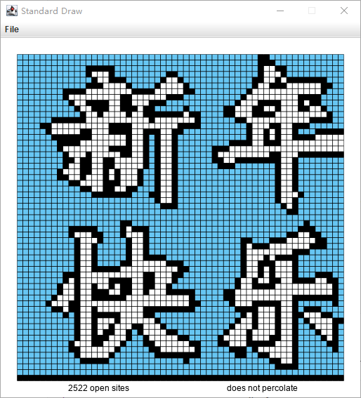
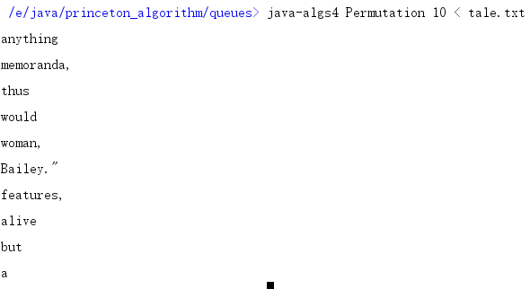

# Princeton_Algorithms_on_Coursera_assignments

**Note:**

The new version of assignments in this course has updated to work with a customized IntelliJ IDE with plugins like Check-style ([read here](<http://coursera.cs.princeton.edu/algs4/checklists/percolation.html>)), and there are great visualizers and some materials by the lectures to help understand the marvelous algorithms, so I keep all the contexts with the to-be-submitted files to give convenience to those who want to see direct results. 

**But as an experienced, I have to say that copy-and-paste is not a good choice. I looked up many discussions and even some source code, really hard to get this 100/100 with bonuses. Those efforts pay.**


## Week1: percolation



*This assignment is like a warm-up but getting 100/100 with a bonus is fairly difficult.*

The lecture mentioned virtual top and bottom nodes help get 100/100 scores very easily. Sure you can do this with two UFs, but the bonus asks you to do it with only one UF.

Ok, but how?

Extra space is needed to record the "state" of the sites in the n-by-n grid.

Some come up with two `boolean` arrays, one bind with bottom, one with top. That works.

My solution is inspired by a blog: <https://segmentfault.com/a/1190000005345079#articleHeader1>.

It's in Chinese but I try to translate the core steps below:

1. Use a byte 2d-array to record the states: 0 for blocked, 1 for open,2 for connected with bottom.
2. When opening a site, assign 2 to its state if it's in the n-th row, or assign 1.
3. Check the 4 neighbors using `uf.find()` : if the state of the neighbor site or that of the current site is 2, write both states to 2 and union the two sites.

In this way, if the state > 0 `isOpen()`  return true; using `uf.connected()` to tell `isFull()`; in each `open()` check if the state of `uf.find(virtualTop)` equals 2 at the last line, using a private `boolean` to save this flag. 

> Aggregate score: 101.25%
>
> Estimated student memory = 9.00 n^2 + 0.00 n + 184.00   (R^2 = 1.000)
>
> Test 2 (bonus): check that total memory <= 11 n^2 + 128 n + 1024 bytes
>
> ==> passed

It feels good.


## Week2: Deque&RandomizedQueue



> It's confusing that this line of code cannot run anywhere else except in the customized-IntelliJ's console.

After discussing queue and stack, this assignment requires students to complete two new data structures: `Deque` and `RandomizedQueue` .

A `Deque` is not hard to code: you can use a bi-directional `linklist`.

Its iterator is a little more complicated, but you can read the slides or textbook for reference.

A `RandomizedQueue` provides random access to the elements and random delete. So using a resizable-array would be reasonable. At first I was so stupid that I thought the location of the randomly selected element should considered. However, you just select one by a random index, swap the last element with this one, reduce the array size by 1 and set the last element as `null` (IMPORTANT: element loitering would be checked). 

The iterator is more or less the same.

The most challenging part of this assignment is still the `bonus` . Once you finish the two data structures, you are finally asked to write a client `Permutation` that reads in a sequence of strings and randomly print out `k` strings. The bonus restricts your memory space to be only proportional  to `k`.

In other words, you've got to find some way to keep `k` strings with the same probability while reading the whole sequence. 

If you are fighting hard with it,  it's recommended to search the key words *Reservoir Sampling* and you'll know how. And this algorithm is very useful to handle big data problems.

## Week3: Collinear


Even easier that Week2. You can use merge sort by calling `Arrays.sort()`.

Read the slides or the textbook for `comparator`s. You shall find the correct code of the Client in `specification`:

```java
        // read the n points from a file
        In in = new In(args[0]);
        int n = in.readInt();
        Point[] points = new Point[n];
        for (int i = 0; i < n; i++) {
            int x = in.readInt();
            int y = in.readInt();
            points[i] = new Point(x, y);
        }

        // draw the points
        StdDraw.enableDoubleBuffering();
        StdDraw.setXscale(0, 32768);
        StdDraw.setYscale(0, 32768);
        StdDraw.setPenColor(StdDraw.BLACK);
        StdDraw.setPenRadius(0.005);
        for (Point p : points) {
            p.draw();
        }

        // print and draw the line segments
        FastCollinearPoints collinear = new FastCollinearPoints(points);
        for (LineSegment segment : collinear.segments()) {
            StdOut.println(segment);
            segment.draw();
        }
        StdDraw.show();
```

In `BruteCollinearPoints`, four loops are used to check if every 4 points are collinear. After writing this you know why it can't handle more-than-4-point-collinear case.

The `FastCollinearPoints` is not too difficult except the corner cases. Collinear points are adjacent after each sort (by slope), and there may be more than 4 collinear points, so you shall explore this until the loop breaks. And in the end, you shall check if the segment has already been logged. One can maintain a `Point[]` to record all the collinear ones and sort it. If the first element of the sorted array is the same point, it means that this point is the most left-down point or the *origin point*, then there's no duplicate.

No bonus this week.

